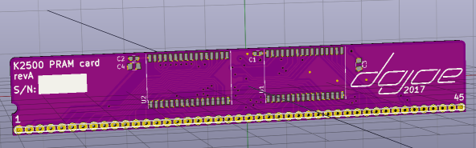
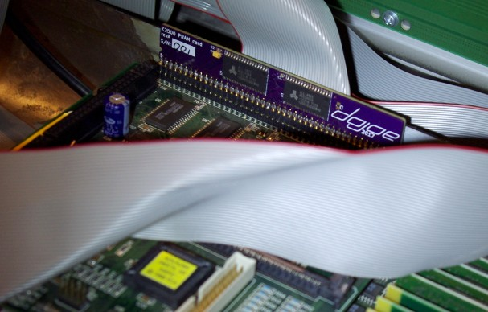

# K2500 P/RAM
A P/RAM extension remake for Kurzweil K2500 synthesizers

## Why?

Because people are demanding upwards of 100$ on eBay for a part that is simple to make and costs about 10$.

## How?

It's basically just a 1MB SRAM board in a 512Kx16 configuration. The original board had eight 128Kx8 SRAMs and some address decoders, 
but thanks to modern technology we don't need that level of complexity as we can just tack two 512Kx8 SRAMs together.
With that, the only tricky part is to get all those wires routed while keeping a low card profile, which is what I did.

## Compatibility

We tested this in a K2500 and it works like a charm.

This will _only_ work in a K2500. It is __not compatible__ with the K2000, that one needs a completely different board.

Depending on how you install it, it may physically clash with a KDFX board. We couldn't try it since we don't have a KDFX,
so if you do, please tell us about it.

And of course I will assume no responsibility for any problems or damage that may arise from you making your own P/RAM from this
design and trying it in a synth. Duh ;)

## The board

This repository contains the KiCAD schematics and board file for the P/RAM extension. There's also a zip file with Gerbers
so you can jump right to ordering a board for yourself, or you simply order from OSHPark directly:

<a href="https://oshpark.com/shared_projects/QDHfglRW"></img></a>

## Parts

The board is built around the AS6C4008, a 5V SRAM chip from Alliance Memory. There may be other pin and voltage compatible parts
out there, but the AS6C4008 is cheap and works. Here's the full BOM, almost too boring to print:

| Designator | Description                       | Digikey part#      | Mouser part#              |
|------------|-----------------------------------|--------------------|---------------------------|
| U1, U2     | Alliance Memory AS6C4008-55ZIN    | 1450-1031-ND       | 913-AS6C4008-55ZIN        |
| J1         | Precision pin header, 45pos, 0.1" | e.g. 1212-1176-ND  | e.g. 437-8008006410001101 |
| C1, C2     | Ceramic Cap X7R 0603 100nF        | ehh                | whatevs                   |
| C3, C4     | Ceramic Cap X7R 0805 1uF          | go find it         | anything goes             |

The trickiest part is probably J1 - you need a pin header with __round pins__, not the usual square ones.
Unfortunately these guys are expensive, but not prohibitively so.

## Assembly and installation

Solder everything up, pin header last. You can mount the pin header through the holes for a 90 degree angle (or use right-angle
headers), or flat onto the pads for an SMD-like connection - I did the latter so the board stands upright on the K2500 mainboard:

Install the card such that pin 1 (numbered and marked by a notch in the card) points towards the closest edge of the mainboard and the memory chips are facing the memory chips on the mainboard -- see the picture above.

The socket inside the K2500 has very tight tolerances, and the pins tend to move during soldering,
so in the end we had to push on the PRAM card really hard for it to properly sit in the socket.
If you can afford taking the processor board out of the K2500, I recommend plugging the pin header into the socket first,
and then soldering the PRAM board to the pin header while it's in the socket. That will keep the pins aligned during
soldering.

